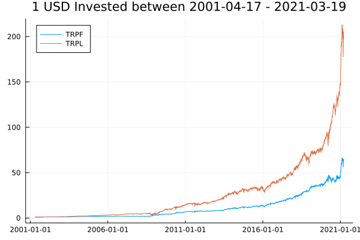

# Comparison between:

## Total Return Portfolio Long (TRLP) and Total Return Portfolio Free (TRPF)

### Overall performance

### Econometric analysis

How do returns behave with respect to the market and during bear markets

<b> Daily Return Regressions 1</b>

$$  \text{🐻}_t = \text{sp500}_{t}/\max_{s <t}{\text{sp500}_{s}} < 0.8$$ 

$$r_t = a+\beta r_{mt} + \gamma \text{🐻}_t +\epsilon_{t} $$ 

-------------------------
|    TRPL        | Coef.           | t  |
| ------------- |:-------------:| -----:|
| (Intercept)  %  | 0.077   | 6.93 |
| $r_{mt}$ %     | 0.67     |  83.23 |
| $\text{🐻}_t$ | 0.067     |    2.75 |

-----------------------------------------

|    TRPF        | Coef.           | t  |
| ------------- |:-------------:| -----:|
| (Intercept)  %  | 0.067    | 5.02 |
| $r_{mt}$ %     | 0.12      |  13.22 |
| $\text{🐻}_t$ | 0.076      |    2.61 |

----------------------------

<b> Daily Return Regressions 2</b>

$$r_t = a+\gamma \text{🐻}_t +\epsilon_{t} $$ 
-------------------------
|    TRPL        | Coef.           | t  |
| ------------- |:-------------:| -----:|
| (Intercept)  %  | 0.1  | 6.27 |
| $\text{🐻}_t$ | 0.018    |    0.49|

---------------------

-------------------------
|    TRPF        | Coef.           | t  |
| ------------- |:-------------:| -----:|
| (Intercept)  %  | 0.07  | 5.37 |
| $\text{🐻}_t$ | 0.066    |   2.26|

$$ \prod_{s=0}^t (1+r_s)$$

